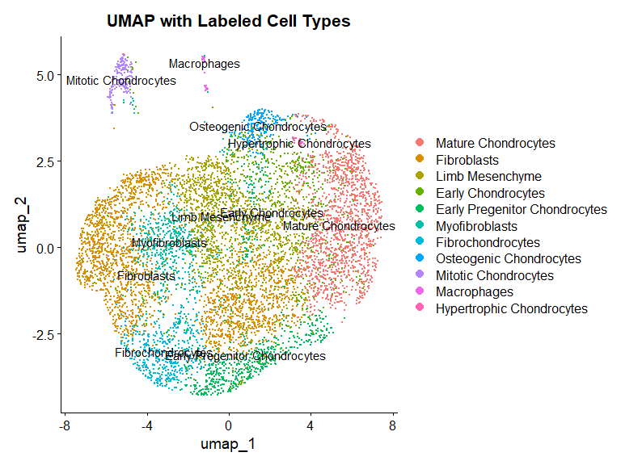

scRNAseq Analysis of GSE292807
================

Single Cell RNAseq Analysis based on the GEO database dataset
[GSE292807](https://www.ncbi.nlm.nih.gov/geo/query/acc.cgi?acc=GSE292807)

Comparison of WT to NOTCH2 gain-of-function chondrocytes  
organism: mus musculus (mouse)

Step by step code

# Libraries

Loading in necessary packages for analysis:

``` r
library(Seurat)
library(ggplot2)
library(glmGamPoi)
library(dplyr)
library(patchwork)
library(ComplexHeatmap)
library(AnnotationHub)
library(clusterProfiler)
library(org.Mm.eg.db)
```

Importing dataset and creating Seurat object:

``` r
counts_het <- Read10X(data.dir = paste0(work_dir, "/Het_NOTCH"))
counts_wt  <- Read10X(data.dir = paste0(work_dir, "/WT_NOTCH"))

Het.s <- CreateSeuratObject(counts = counts_het, project = "Het", min.cells = 3, min.features = 200)
WT.s  <- CreateSeuratObject(counts = counts_wt,  project = "WT", min.cells = 3, min.features = 200)
```

# QC filtering

``` r
Het.s[["percent.mt"]] <- PercentageFeatureSet(Het.s, pattern = "^mt-")
WT.s[["percent.mt"]] <- PercentageFeatureSet(WT.s, pattern = "^mt-")
```

Violin plots for filtering for Seurat Object Het.s:

``` r
p1 <- VlnPlot(Het.s, features = c("nFeature_RNA", "nCount_RNA", "percent.mt"), ncol = 3) + labs(x = "Identity", y = "Expression Level")
p2 <- FeatureScatter(Het.s, feature1 = "nCount_RNA", feature2 = "nFeature_RNA", group.by = "orig.ident", pt.size = 0.5) 
p3 <- FeatureScatter(Het.s, feature1 = "percent.mt", feature2 = "nFeature_RNA", group.by = "orig.ident", pt.size = 0.5) 
p4 <- p2 + p3
```

<!-- --><!-- -->

Violin plots for filtering for Seurat Object WT.s:

``` r
p1 <- VlnPlot(WT.s, features = c("nFeature_RNA", "nCount_RNA", "percent.mt"), ncol = 3) + labs(x = "Identity", y = "Expression Level")
p2 <- FeatureScatter(WT.s, feature1 = "nCount_RNA", feature2 = "nFeature_RNA", group.by = "orig.ident", pt.size = 0.5) 
p3 <- FeatureScatter(WT.s, feature1 = "percent.mt", feature2 = "nFeature_RNA", group.by = "orig.ident", pt.size = 0.5) 
p4 <- p2 + p3
```

<!-- --><!-- -->

Subset based on Cells with 15000 \> nFeature \> 250, \>10% percent mt
and 15000 \> nCount.

``` r
Het_subset.s <- subset(Het.s, subset = nFeature_RNA > 250 & nFeature_RNA < 10000 & nCount_RNA < 15000 & percent.mt < 10)
WT_subset.s <- subset(WT.s, subset = nFeature_RNA > 250 & nFeature_RNA < 10000 & nCount_RNA < 15000 & percent.mt < 10)
```

# Normalization

The next step include merging the two datasets, normalization using
SCTranform, dimensional reduction using PCA and UMAP, integration, and
lastly clu

``` r
combined.s <- merge(x = Het_subset.s, y = WT_subset.s, project = "combined", add.cell.ids = c("Het", "WT"))
Idents(combined.s) <- "orig.ident"
combined.s <- SCTransform(combined.s, vars.to.regress = "percent.mt", assay = "RNA")
combined.s <- RunPCA(combined.s, assay = "SCT", verbose = FALSE)
```

Elbow plot:

For this analysis, 1:10 was chosen due to a not so great elbow curve.

``` r
ElbowPlot(combined.s)
```

<!-- -->

Integration, UMAP, finding neighbors and clustering:

``` r
combined.s <- IntegrateLayers(object = combined.s, method = CCAIntegration, assay = "SCT", normalization.method = "SCT", orig.reduction = "pca", new.reduction = "integrated.cca", verbose = FALSE)

combined.s <- RunUMAP(combined.s, reduction = "integrated.cca", dims = 1:10)
combined.s <- FindNeighbors(combined.s, reduction = "integrated.cca", dims = 1:10)
combined.s <- FindClusters(combined.s, resolution = 0.5)
```

    ## Modularity Optimizer version 1.3.0 by Ludo Waltman and Nees Jan van Eck
    ## 
    ## Number of nodes: 7832
    ## Number of edges: 238877
    ## 
    ## Running Louvain algorithm...
    ## Maximum modularity in 10 random starts: 0.8164
    ## Number of communities: 12
    ## Elapsed time: 0 seconds

As a result of the previous steps, we have our first visualization of
the data:

``` r
u1 <- DimPlot(combined.s, reduction = "umap", label = TRUE, group.by = "seurat_clusters") +
  labs(title = "UMAP by Clusters")
u2 <- DimPlot(combined.s, reduction = "umap", label = TRUE, group.by = "orig.ident") +
  labs(title = "UMAP by Identity")
u3 <- u1 + u2
plot(u3)
```

<!-- -->

Due to the nature of the study which isolates chondrocytes, distinct
clustering was not expected.

# Cell Type Labeling

The next step is to label the clusters by their cell type, we can use a
loop to identify the top 5 marker genes of each cluster:

``` r
Idents(combined.s) <- "seurat_clusters"
combined.s <- PrepSCTFindMarkers(combined.s)
clusters <- levels(combined.s)

for (cluster in clusters) {
  markers <- FindMarkers(combined.s,
  ident.1 = cluster,
  only.pos = TRUE,
  min.pct = 0.25,
  logfc.threshold = 0.25,
  assay = "SCT")
  top5_genes <- head(rownames(markers), 5)
  vln_plots <- lapply(top5_genes, function(gene) {VlnPlot(combined.s, features = gene, pt.size = 0) + labs(title = gene, x = "Identity", y = "Expression Level") + theme(legend.position = "none")
  })

  all_5_plots <- wrap_plots(vln_plots, ncol = 1)
}
```

A example output:

    ##              p_val avg_log2FC pct.1 pct.2    p_val_adj
    ## Snorc 6.661089e-26  1.4545833 0.815 0.128 1.219779e-21
    ## Msmp  3.510434e-18  0.7770004 0.852 0.211 6.428307e-14
    ## Rpl38 1.796449e-16  0.8815131 1.000 1.000 3.289658e-12
    ## Ubb   7.150191e-16  1.2409378 1.000 1.000 1.309343e-11
    ## G0s2  1.250751e-15  1.8587279 1.000 0.525 2.290375e-11
    ## Rps21 8.373673e-15  0.7058947 1.000 1.000 1.533387e-10

<!-- -->

There are many ways to perform cell type labeling, including automated
packages. Based on my previous training, I performed manual cell type
labeling using the [PanglaoDB - A Single Cell Sequencing Resource For
Gene Expression Data](https://panglaodb.se/) and through literature
review.

Once cell types are properly identified, the next step is to label the
clusters:

``` r
Idents(combined.s) <- "seurat_clusters"

cell_type_naming <- c(
  "0" = "Mature Chondrocytes",
  "1" = "Fibroblasts",
  "2" = "Limb Mesenchyme",
  "3" = "Fibroblasts", 
  "4" = "Early Chondrocytes",
  "5" = "Early Pregenitor Chondrocytes",
  "6" = "Myofibroblasts",
  "7" = "Fibrochondrocytes",
  "8" = "Osteogenic Chondrocytes",
  "9" = "Mitotic Chondrocytes",
  "10" = "Macrophages",
  "11" = "Hypertrophic Chondrocytes")

combined.s <- RenameIdents(combined.s, cell_type_naming)
combined.s$cell_type <- Idents(combined.s)
```

As a result, our plots now look like this:

<!-- -->

With cell types correctly labeled, there’s a few other visualizations
that can be made.

Bar graph displaying number of cells per cell type:

``` r
cell_counts <- combined.s@meta.data %>%
  group_by(orig.ident, cell_type) %>%
  summarise(n = n(), .groups = "drop")

b1 <- ggplot(cell_counts, aes(x = orig.ident, y = n, fill = cell_type)) +
  geom_bar(stat = "identity") +
  labs(x = "Condition", y = "Number of Cells", fill = "Cell Type") +
  theme_minimal()
```

<!-- -->

# Differential Expression Analysis

The next steps in the single cell analysis pipeline is differential
expression analysis Like before, we utilize a loop to generate lists of
all differentially expressed genes per cell type.

``` r
Idents(combined.s) <- "cell_type"
cell_type <- levels(combined.s) 

combined.s <- PrepSCTFindMarkers(combined.s, assay = "SCT")
for (cell in cell_type) {
  celltype_subset <- subset(combined.s, idents = cell)
  de_results <- FindMarkers(celltype_subset,
                            ident.1 = "WT",
                            ident.2 = "Het",
                            group.by = "orig.ident",
                            assay = "SCT",
                            logfc.threshold = 0.25,
                            min.pct = 0.1,
                            only.pos = FALSE,
                            recorrect_umi = FALSE)
if (nrow(de_results) > 0) {
  current_cluster <- paste0("DE_", gsub(" ", "_", cell), "_WT_vs_Het")
  assign(current_cluster, de_results)
}
}
```

The output of this loop can be saved per cell type for further analysis.
For showcase purposes, I have decided to focus on the DE of Fibroblasts.

``` r
fibro_only <- subset(combined.s, subset = cell_type == "Fibroblasts")

fibro_top_genes <- DE_Fibroblasts_WT_vs_Het[abs(DE_Fibroblasts_WT_vs_Het$avg_log2FC) > 1 
                                            & DE_Fibroblasts_WT_vs_Het$p_val_adj < 0.05,]
```

A simple visualization of the top differentially expressed genes between
the fibroblasts would be using dot plots:

``` r
d1 <- DotPlot(fibro_only, features = rownames(fibro_top_genes), group.by = "orig.ident") +
  labs(title = "DEGs Fibroblast only")
d2 <- DotPlot(combined.s, features = rownames(fibro_top_genes), group.by = "orig.ident") +
  labs(title = "DEGs Combined")
```

<!-- --><!-- -->

The output of this step can be used to identify DEGs that contribute to
the the experimental design. It is useful in identifying genes of
interest that contribute to diseases, medicine, and meaningful
biological differences. A secondary analysis step that is common to
perform is Pathway Enrichment.

# Pathway Enrichment

Using the results of differential expression analysis, going a step
further would be pathway enrichment. While clients may be happy to get a
list of differentially expressed genes, the next step would be to look
at the pathways involved with these genes to get a bigger picture. These
analyses make use of the [Gene Ontology
Resource](https://geneontology.org) and [KEGG PATHWAY
Database](https://www.genome.jp/kegg/pathway.html) databases.

Creating gene lists based on parameters: log2fc \> 0.25 and \< - 0.25
p-value adjusted \< 0.05:

``` r
fibro_sig_genes <- DE_Fibroblasts_WT_vs_Het[abs(DE_Fibroblasts_WT_vs_Het$avg_log2FC) > 0.25 
                                            & DE_Fibroblasts_WT_vs_Het$p_val_adj < 0.05,]


fibro_sig_genes$entrez_id <- mapIds(org.Mm.eg.db,
                     keys = rownames(fibro_sig_genes),
                     column = "ENTREZID",
                     keytype = "SYMBOL",
                     multiVals = "first")
```

This is an example function of running GO Enrichment on all 3 gene lists
(Total, up, down) and ont (BP, MF, CC) based on gene_list (complete list
of significant DEGs).

``` r
run_go <- function(gene_list) {
  
  onts <- c("BP", "CC", "MF")
  
  for (ont in onts) {
    #Total
    ego <- enrichGO(gene = gene_list$entrez_id,
           OrgDb = org.Mm.eg.db,
           keyType = "ENTREZID",
           ont = ont,
           pAdjustMethod = "BH",
           pvalueCutoff = 0.05,
           qvalueCutoff = 0.2,
           readable = TRUE)
  
    if (!is.null(ego) && nrow(ego@result) > 0) {
  
    d1 <- dotplot(ego, showCategory=10) + ggtitle(paste("Total GO Enrichment -", ont))
    }
  
    genes_up <- gene_list$entrez_id[gene_list$avg_log2FC > 0]
    genes_down <- gene_list$entrez_id[gene_list$avg_log2FC < 0]
  
    #Up 
    up <- enrichGO(gene = genes_up,
                   OrgDb = org.Mm.eg.db,
                   keyType = "ENTREZID",
                   ont = ont,
                   pAdjustMethod = "BH",
                   pvalueCutoff = 0.05,
                   qvalueCutoff = 0.2,
                   readable = TRUE)
    
    if (!is.null(up) && nrow(up@result) > 0) {
    d2 <- dotplot(up, showCategory=10) + ggtitle(paste("Upregulated GO Enrichment -", ont))
    }
  
    #Down
    down <- enrichGO(gene = genes_down,
                     OrgDb = org.Mm.eg.db,
                     keyType = "ENTREZID",
                     ont = ont,
                     pAdjustMethod = "BH",
                     pvalueCutoff = 0.05,
                     qvalueCutoff = 0.2,
                     readable = TRUE)
  
    if (!is.null(down) && nrow(down@result) > 0) {
    d3 <- dotplot(down, showCategory=10) + ggtitle(paste("Downregulated GO Enrichment -", ont))
    }
  }
}
```

Example output:

<!-- -->

    ##                    ID                                   Description GeneRatio
    ## GO:0061448 GO:0061448                 connective tissue development    21/191
    ## GO:0030198 GO:0030198             extracellular matrix organization    21/191
    ## GO:0045229 GO:0045229 external encapsulating structure organization    21/191
    ## GO:0043062 GO:0043062          extracellular structure organization    21/191
    ## GO:0050678 GO:0050678   regulation of epithelial cell proliferation    22/191
    ## GO:0051216 GO:0051216                         cartilage development    16/191
    ##              BgRatio RichFactor FoldEnrichment   zScore       pvalue
    ## GO:0061448 335/28832 0.06268657       9.462718 12.72287 1.044225e-14
    ## GO:0030198 337/28832 0.06231454       9.406559 12.67656 1.174431e-14
    ## GO:0045229 338/28832 0.06213018       9.378729 12.65355 1.245134e-14
    ## GO:0043062 339/28832 0.06194690       9.351063 12.63063 1.319835e-14
    ## GO:0050678 434/28832 0.05069124       7.651989 11.40263 1.780017e-13
    ## GO:0051216 235/28832 0.06808511      10.277643 11.66175 5.053080e-12
    ##                p.adjust       qvalue
    ## GO:0061448 1.118890e-11 7.213942e-12
    ## GO:0030198 1.118890e-11 7.213942e-12
    ## GO:0045229 1.118890e-11 7.213942e-12
    ## GO:0043062 1.118890e-11 7.213942e-12
    ## GO:0050678 1.207208e-10 7.783360e-11
    ## GO:0051216 2.855833e-09 1.841272e-09
    ##                                                                                                                                     geneID
    ## GO:0061448          Egr1/Sfrp2/Ccn1/Acta2/Acan/Ccn4/Nfia/Efemp1/Col2a1/Id2/Thra/Rspo2/Maf/Col11a1/Pdgfrb/Wnt5a/Col9a1/Lrp6/Prrx2/Cd34/Cnmd
    ## GO:0030198 Sfrp2/Egfl6/Ccn1/Acan/Tgfbr3/Fap/Ramp2/Col2a1/Adamts5/Eln/Col4a1/Cst3/Col11a1/App/Ptx3/Scara3/Col9a1/Apbb2/Loxl1/Col4a2/Adamts1
    ## GO:0045229 Sfrp2/Egfl6/Ccn1/Acan/Tgfbr3/Fap/Ramp2/Col2a1/Adamts5/Eln/Col4a1/Cst3/Col11a1/App/Ptx3/Scara3/Col9a1/Apbb2/Loxl1/Col4a2/Adamts1
    ## GO:0043062 Sfrp2/Egfl6/Ccn1/Acan/Tgfbr3/Fap/Ramp2/Col2a1/Adamts5/Eln/Col4a1/Cst3/Col11a1/App/Ptx3/Scara3/Col9a1/Apbb2/Loxl1/Col4a2/Adamts1
    ## GO:0050678        Gas1/Sfrp2/Jun/Zfp36/Id1/Dlk1/Tgfbr3/Nme1/Sfrp1/Rbpj/Fgf10/Nupr1/Gpc3/Ccnd2/Ptn/Nr4a1/Cdkn1b/Hmgb2/Wnt5a/Lrp6/Ccnd1/Cnmd
    ## GO:0051216                                     Sfrp2/Ccn1/Acan/Ccn4/Nfia/Efemp1/Col2a1/Thra/Rspo2/Maf/Col11a1/Wnt5a/Col9a1/Lrp6/Prrx2/Cnmd
    ##            Count
    ## GO:0061448    21
    ## GO:0030198    21
    ## GO:0045229    21
    ## GO:0043062    21
    ## GO:0050678    22
    ## GO:0051216    16

KEGG is similar, but there’s option for different ontologies:

``` r
run_kegg <- function(gene_list) {
  #Total
  kegg <- enrichKEGG(gene = gene_list$entrez_id,
                           organism = 'mmu',            
                           keyType = "kegg",           
                           pAdjustMethod= "BH",
                           pvalueCutoff = 0.05,
                           qvalueCutoff = 0.2)
  
  if (!is.null(kegg) && nrow(kegg@result) > 0) {
    d1 <- dotplot(kegg, showCategory = 10) + ggtitle("Total KEGG Enrichment")
  }
  
  genes_up <- gene_list$entrez_id[gene_list$avg_log2FC > 0]
  genes_down <- gene_list$entrez_id[gene_list$avg_log2FC < 0]
  
  #Up
  kegg_up <- enrichKEGG(gene = genes_up,
                          organism = 'mmu',
                          keyType = "kegg",
                          pAdjustMethod = "BH",
                          pvalueCutoff = 0.05,
                          qvalueCutoff = 0.2)
  if (!is.null(kegg_up) && nrow(kegg_up@result) > 0) {
    d2 <- dotplot(kegg_up, showCategory = 10) + ggtitle("Upregulated KEGG Enrichment")
    }
  
  
  #Down
    kegg_down <- enrichKEGG(gene = genes_down,
                            organism = 'mmu',
                            keyType = "kegg",
                            pAdjustMethod = "BH",
                            pvalueCutoff = 0.05,
                            qvalueCutoff = 0.2)
    if (!is.null(kegg_down) && nrow(kegg_down@result) > 0) {
      d3 <- dotplot(kegg_down, showCategory = 10) + ggtitle("Downregulated KEGG Enrichment")
    }
  
}
```

<!-- -->

    ##                                      category                     subcategory
    ## mmu04510                   Cellular Processes Cellular community - eukaryotes
    ## mmu04151 Environmental Information Processing             Signal transduction
    ## mmu04310 Environmental Information Processing             Signal transduction
    ## mmu05208                       Human Diseases                Cancer: overview
    ## mmu04974                   Organismal Systems                Digestive system
    ## mmu05010                       Human Diseases       Neurodegenerative disease
    ##                ID                                       Description GeneRatio
    ## mmu04510 mmu04510                                    Focal adhesion    12/108
    ## mmu04151 mmu04151                        PI3K-Akt signaling pathway    15/108
    ## mmu04310 mmu04310                             Wnt signaling pathway    10/108
    ## mmu05208 mmu05208 Chemical carcinogenesis - reactive oxygen species    11/108
    ## mmu04974 mmu04974                  Protein digestion and absorption     7/108
    ## mmu05010 mmu05010                                 Alzheimer disease    13/108
    ##            BgRatio RichFactor FoldEnrichment   zScore       pvalue     p.adjust
    ## mmu04510 202/10566 0.05940594       5.811881 7.016963 9.610941e-07 0.0002027909
    ## mmu04151 368/10566 0.04076087       3.987772 5.928381 4.637449e-06 0.0004892509
    ## mmu04310 175/10566 0.05714286       5.590476 6.222579 1.146821e-05 0.0008065978
    ## mmu05208 229/10566 0.04803493       4.699418 5.751434 2.120646e-05 0.0011186409
    ## mmu04974 108/10566 0.06481481       6.341049 5.669392 1.145551e-04 0.0048342260
    ## mmu05010 389/10566 0.03341902       3.269494 4.634644 1.610210e-04 0.0056625734
    ##                qvalue
    ## mmu04510 0.0001466933
    ## mmu04151 0.0003539106
    ## mmu04310 0.0005834706
    ## mmu05208 0.0008091939
    ## mmu04974 0.0034969457
    ## mmu05010 0.0040961494
    ##                                                                                             geneID
    ## mmu04510                  16476/13730/12824/12826/15234/18596/12444/13731/12839/12443/215449/12827
    ## mmu04151 12824/17210/12826/17311/15234/14165/18596/12444/74551/15370/12576/13685/12839/12443/12827
    ## mmu04310                              20319/16476/22402/20377/239405/12444/22418/16974/12443/93735
    ## mmu05208                         17710/14281/17718/17709/17705/17716/16476/17720/18035/15234/14871
    ## mmu04974                                                 12824/13717/12826/12814/17380/12839/12827
    ## mmu05010             17710/17718/17709/17705/17716/17720/11820/13198/17380/12421/22418/16974/93735
    ##          Count
    ## mmu04510    12
    ## mmu04151    15
    ## mmu04310    10
    ## mmu05208    11
    ## mmu04974     7
    ## mmu05010    13

Based on these results, we can further analyze how a gain of function of
the NOTCH gene affects the differentiation, proliferation, and
organization of fibroblasts.
